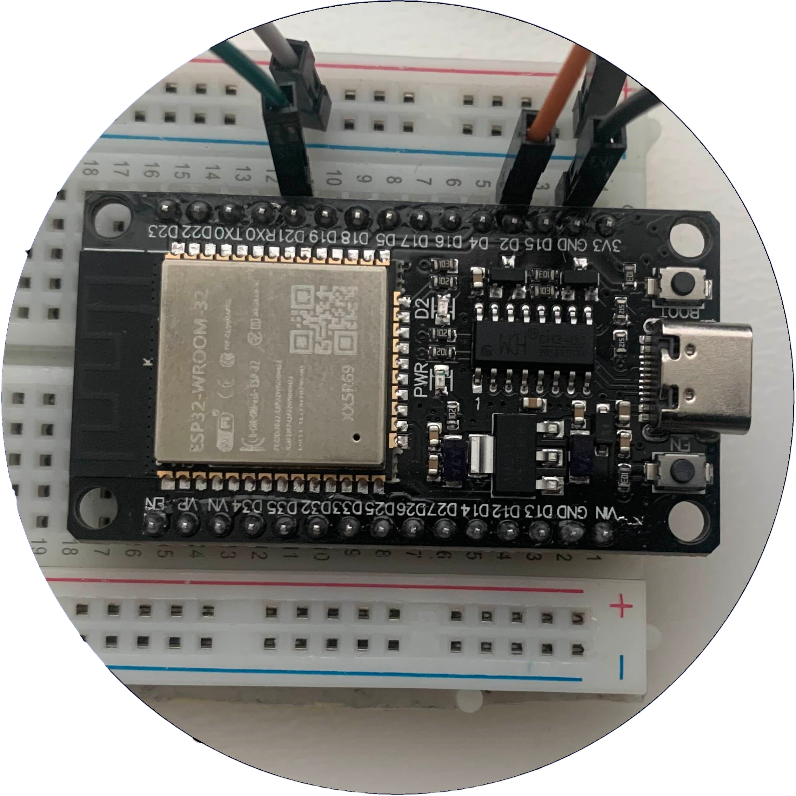

<!-- PROJECT LOGO -->
<br />
<div align="center">
  <a href="https://github.com/PetabyteBrain/Home-Automation">
    
  </a>

<h3 align="center">Home Automation System</h3>
<h4 align="center">Module: Window blind control</h4>

  <p align="center">
    A Home Automation System built with Esp32 boards.
    <br />
    <a href="https://github.com/PetabyteBrain/Home-Automation"><strong>Explore the docs »</strong></a>
    <br />
    <br />
    <a href="https://github.com/PetabyteBrain/Home-Automation">View Demo</a>
    ·
    <a href="https://github.com/PetabyteBrain/Home-Automation/issues/new?labels=bug&template=bug-report---.md">Report Bug</a>
    ·
    <a href="https://github.com/PetabyteBrain/Home-Automation/issues/new?labels=enhancement&template=feature-request---.md">Request Feature</a>
  </p>
</div>

<!-- TABLE OF CONTENTS -->
<details>
  <summary>Table of Contents</summary>
  <ol>
    <li>
      <a href="#about-the-Module">About The Module</a>
      <ul>
        <li><a href="#built-with">Built With</a></li>
      </ul>
    </li>
    <li>
      <a href="#getting-started">Getting Started</a>
      <ul>
        <li><a href="#prerequisites">Prerequisites</a></li>
        <li><a href="#works-with">works with</a></li>
        <li><a href="#installation">Installation</a></li>
      </ul>
    </li>
    <li><a href="#usage">Usage</a></li>
    <li><a href="#roadmap">Roadmap</a></li>
    <li><a href="#contributing">Contributing</a></li>
    <li><a href="#license">License</a></li>
    <li><a href="#contact">Contact</a></li>
    <li><a href="#acknowledgments">Acknowledgments</a></li>
  </ol>
</details>

## About The Module

[![Keychain Button Server-side][product-screenshot]](https://example.com)
[![Keychain Button Client-side][product-screenshot2]](https://example.com)


<p align="right">(<a href="#readme-top">back to top</a>)</p>


### Built With

This module was built with an Esp32 board and was programmed with the Arduino Ide.
The Libraries used for this project were:
1. ...
2. ...
3. ...
4. ...
5. ...


* [![Cplusplus][CPP.cpp]][CPP-url]


<p align="right">(<a href="#readme-top">back to top</a>)</p>

<!-- GETTING STARTED -->
## Getting Started

...

### Prerequisites

you need these things to be able to build this Module:

#### Hardware:
1. Atlease one Esp32 boards (more needed if the trigger should be external)
2. Breadboard
3. Jumpercables for Breadboard
4. LEDs to show status (green, Blue, Red)
5. Buttons
6. 3D printer / housing for the module(to Print the case for the Module) ***optional***

#### Software:
1. Arduino IDE (to programm the microcontrollers)

After having checked these prerequisites you should be ready to build this Module.

### works with
Depending on the Usecase and the Setup used there are countless possibilities for Modules to be created and adapted, for that reason I made a List with multiple example Modules that can be used as is or adapted for individual use.

1. Keychain Button trigger.
2. Stepper Motor Extension cord activator
3. ... ([Click here to see all the Modules.](https://github.com/PetabyteBrain/Home-Automation/tree/main/Modules))

### Installation

To install and setup this Module you first have to connect all the pins to it's corresponding places, the chapter below shows the connection in detail.
After having connected the boards you can flash both of the ESP32 boards with the code in the [scripts folder.](https://github.com/PetabyteBrain/Home-Automation/tree/main/Modules/WindowBlindControl/scripts)
Now you just need to plug it in and the Module should be working.
#### Connections

##### Window Blind (Timer)
These are the connections for the version of the module that activates on a Timer based system:

[![Window Blind Timer][diagram-screenshot]](https://example.com)

...
...
(Coming soon)

##### Window Blind (Daylight Sensor)
These are the connections for the version of the module that activates depending on how much light there is outside:

[![Keychain Button Server-side][diagram-screenshot2]](https://example.com)

...
...
(Coming soon)

##### Window Blind (Button Press)
These are the connections for the version of the module that activates depending on how much light there is outside:

[![Keychain Button Server-side][diagram-screenshot2]](https://example.com)

...
...
(Coming soon)

<p align="right">(<a href="#readme-top">back to top</a>)</p>


<!-- USAGE EXAMPLES -->
## Usage

This Project can be applicable in multiple different usecases and as such cannot just get copied across and used in the same way for everyone.

Here are a couple of Examples of how these Modules can be put to use:

### 1. Automatic 8am Blind opening
A Use case for the Time based system is that it automatically opens the blinds at a certain time in the morning so that light gets in the room / house without needing the assistance of a person doing it. 
This system can also act as a help for people that have trouble waking up in the morning.
...

### 2. Detecting Lightlevel to control the blinds
The second version of this Module works with a sensor that detects the Lightlevel. This sensor can be placed outside or on the edge of a window so that it can detect how much light there is at the moment, then it can adapt to the values and open or close the blinds more or less depending on what value it reads.
...

### 3. Button press to open / close Blinds
The third version would be to have Buttons connected to the same Esp32 or to a seperate one so that the blinds can be controlled remotely / automatically. This can make the opening and closing of blinds easier as it can then be doen by a button press instead of having to wind the blinds up or down.
...

These Module Ideas can be adapted and / or combined so that it fits better to the persons Usecase.

_For more examples, please refer to the different [Modules](https://github.com/PetabyteBrain/Home-Automation/tree/main/Modules)_

<p align="right">(<a href="#readme-top">back to top</a>)</p>


<!-- ROADMAP -->
## Roadmap

- [x] Get Idea for Module
- [x] plan construction and functioning
- [x] split module into seperate parts (example: buton trigger & motor activator)
- [ ] research in detail how to make seperate parts function
  - [ ] start building module on breadboard
  - [ ] programm module.
- [ ] Design Housing for the seperate parts of the module
  - [ ] 3d print and test out module with housing
  - [ ] make changes if need be
- [ ] document module
  - [ ] create Diagram of Module and add to document
  - [ ] document function and utility of Module

See the [open issues](https://github.com/PetabyteBrain/Home-Automation/issues) for a full list of proposed features (and known issues).

<p align="right">(<a href="#readme-top">back to top</a>)</p>


<!-- CONTRIBUTING -->
## Contributing

Contributions are what make the open source community such an amazing place to learn, inspire, and create. Any contributions you make are **greatly appreciated**.

If you have a suggestion that would make this better, please fork the repo and create a pull request. You can also simply open an issue with the tag "enhancement".
Don't forget to give the project a star! Thanks again!

1. Fork the Project
2. Create your Feature Branch (`git checkout -b feature/AmazingFeature`)
3. Commit your Changes (`git commit -m 'Add some AmazingFeature'`)
4. Push to the Branch (`git push origin feature/AmazingFeature`)
5. Open a Pull Request

<p align="right">(<a href="#readme-top">back to top</a>)</p>


<!-- LICENSE -->
## License
This Readme file is under the MIT License and the Rest of the Project is under the GNU General Public License. See `LICENSE.txt` for more information.

### MIT License 
```
MIT License

Copyright (c) 2021 Othneil Drew

Permission is hereby granted, free of charge, to any person obtaining a copy
of this software and associated documentation files (the "Software"), to deal
in the Software without restriction, including without limitation the rights
to use, copy, modify, merge, publish, distribute, sublicense, and/or sell
copies of the Software, and to permit persons to whom the Software is
furnished to do so, subject to the following conditions:

The above copyright notice and this permission notice shall be included in all
copies or substantial portions of the Software.

THE SOFTWARE IS PROVIDED "AS IS", WITHOUT WARRANTY OF ANY KIND, EXPRESS OR
IMPLIED, INCLUDING BUT NOT LIMITED TO THE WARRANTIES OF MERCHANTABILITY,
FITNESS FOR A PARTICULAR PURPOSE AND NONINFRINGEMENT. IN NO EVENT SHALL THE
AUTHORS OR COPYRIGHT HOLDERS BE LIABLE FOR ANY CLAIM, DAMAGES OR OTHER
LIABILITY, WHETHER IN AN ACTION OF CONTRACT, TORT OR OTHERWISE, ARISING FROM,
OUT OF OR IN CONNECTION WITH THE SOFTWARE OR THE USE OR OTHER DEALINGS IN THE
SOFTWARE.
```

<p align="right">(<a href="#readme-top">back to top</a>)</p>


<!-- CONTACT -->
## Contact

Spyros Catéchis - catechisspyros@gmail.com

Project Link: [https://github.com/PetabyteBrain/Home-Automation](https://github.com/PetabyteBrain/Home-Automation)

<p align="right">(<a href="#readme-top">back to top</a>)</p>


<!-- ACKNOWLEDGMENTS -->
## Acknowledgments

* []()
* [stepper motors and arduino the ultimate guide](https://howtomechatronics.com/tutorials/arduino/stepper-motors-and-arduino-the-ultimate-guide)
* [Planning connection for Esp32](https://wokwi.com/projects/new/esp32)
* [Github Readme Template](https://github.com/othneildrew/Best-README-Template)

<p align="right">(<a href="#readme-top">back to top</a>)</p>


<!-- MARKDOWN LINKS & IMAGES -->
<!-- https://www.markdownguide.org/basic-syntax/#reference-style-links -->
[contributors-shield]: https://img.shields.io/github/contributors/PetabyteBrain/Home-Automation.svg?style=for-the-badge
[contributors-url]: https://github.com/PetabyteBrain/Home-Automation/graphs/contributors
[forks-shield]: https://img.shields.io/github/forks/PetabyteBrain/Home-Automation.svg?style=for-the-badge
[forks-url]: https://github.com/PetabyteBrain/Home-Automation/network/members
[stars-shield]: https://img.shields.io/github/stars/PetabyteBrain/Home-Automation.svg?style=for-the-badge
[stars-url]: https://github.com/PetabyteBrain/Home-Automation/stargazers
[issues-shield]: https://img.shields.io/github/issues/PetabyteBrain/Home-Automation.svg?style=for-the-badge
[issues-url]: https://github.com/PetabyteBrain/Home-Automation/issues
[license-shield]: https://img.shields.io/github/license/PetabyteBrain/Home-Automation.svg?style=for-the-badge
[license-url]: https://github.com/PetabyteBrain/Home-Automation/blob/master/LICENSE.txt
[linkedin-shield]: https://img.shields.io/badge/-LinkedIn-black.svg?style=for-the-badge&logo=linkedin&colorB=555
[linkedin-url]: https://linkedin.com/in/spyros-catechis-0117242a6
[product-screenshot]: images/keychainButtonClient.jpg
[product-screenshot2]: images/keychainButtonServer.jpg
[diagram-screenshot]: images/circuitDiagram_ServerSide.png
[diagram-screenshot2]: images/circuitDiagram_ClientSide.png
[CPP.cpp]: https://img.shields.io/badge/C-00599C?style=for-the-badge&logo=c&logoColor=white
[CPP-url]: https://www.arduino.cc/
