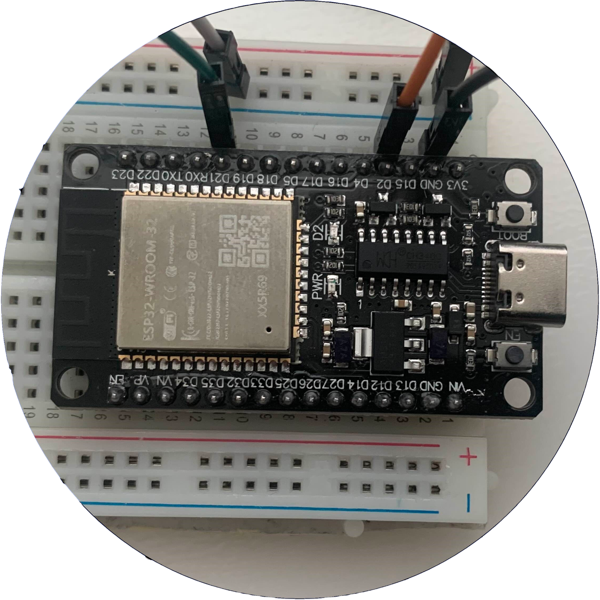

<!-- Improved compatibility of back to top link: See: https://github.com/othneildrew/Best-README-Template/pull/73 -->
<a id="readme-top"></a>
<!--
*** Thanks for checking out the Best-README-Template. If you have a suggestion
*** that would make this better, please fork the repo and create a pull request
*** or simply open an issue with the tag "enhancement".
*** Don't forget to give the project a star!
*** Thanks again! Now go create something AMAZING! :D
-->


<!-- PROJECT SHIELDS -->
<!--
*** I'm using markdown "reference style" links for readability.
*** Reference links are enclosed in brackets [ ] instead of parentheses ( ).
*** See the bottom of this document for the declaration of the reference variables
*** for contributors-url, forks-url, etc. This is an optional, concise syntax you may use.
*** https://www.markdownguide.org/basic-syntax/#reference-style-links
-->
[![Contributors][contributors-shield]][contributors-url]
[![Forks][forks-shield]][forks-url]
[![Stargazers][stars-shield]][stars-url]
[![Issues][issues-shield]][issues-url]
[![MIT License][license-shield]][license-url]
[![LinkedIn][linkedin-shield]][linkedin-url]


<!-- PROJECT LOGO -->
<br />
<div align="center">
  <a href="https://github.com/PetabyteBrain/Home-Automation">
    
  </a>

<h3 align="center">Home Automation System</h3>

  <p align="center">
    A Home Automation System built with Esp32 boards. (In progress)
    <br />
    <a href="https://github.com/PetabyteBrain/Home-Automation"><strong>Explore the docs »</strong></a>
    <br />
    <br />
    <a href="https://github.com/PetabyteBrain/Home-Automation">View Demo</a>
    ·
    <a href="https://github.com/PetabyteBrain/Home-Automation/issues/new?labels=bug&template=bug-report---.md">Report Bug</a>
    ·
    <a href="https://github.com/PetabyteBrain/Home-Automation/issues/new?labels=enhancement&template=feature-request---.md">Request Feature</a>
  </p>
</div>


<!-- TABLE OF CONTENTS -->
<details>
  <summary>Table of Contents</summary>
  <ol>
    <li>
      <a href="#about-the-project">About The Project</a>
      <ul>
        <li><a href="#built-with">Built With</a></li>
      </ul>
    </li>
    <li>
      <a href="#getting-started">Getting Started</a>
      <ul>
        <li><a href="#prerequisites">Prerequisites</a></li>
        <li><a href="#Modules">Modules</a></li>
        <li><a href="#installation">Installation</a></li>
      </ul>
    </li>
    <li><a href="#usage">Usage</a></li>
    <li><a href="#roadmap">Roadmap</a></li>
    <li><a href="#contributing">Contributing</a></li>
    <li><a href="#license">License</a></li>
    <li><a href="#contact">Contact</a></li>
    <li><a href="#acknowledgments">Acknowledgments</a></li>
  </ol>
</details>


<!-- ABOUT THE PROJECT -->
## About The Project

[![Product Name Screen Shot][product-screenshot]](https://example.com)

The Goal of this Project is to automate daily processes in a house. These automated processes can be triggered through different things, for example:(Placing Keys on a Dish while entering room, Trigger with a Timer/Date or something else). 

<p align="right">(<a href="#readme-top">back to top</a>)</p>


### Built With

The modules were built with Esp32 boards and were programmed with the Arduino Ide.

The libraries used might be different depending on the Module, for more Details go check out the different [Modules.](https://github.com/PetabyteBrain/Home-Automation/tree/main/Modules)

* [![Cplusplus][CPP.cpp]][CPP-url]


<p align="right">(<a href="#readme-top">back to top</a>)</p>


<!-- GETTING STARTED -->
## Getting Started

The first step to automating processes is to find something that needs to be automated, may that be watering the plants or turning on a light when you enter a room.

### Prerequisites

you need these things to be able to build the Modules:

#### Hardware:
1. One or more Esp32 boards (Amount depends on the number of Modules that you need)
2. Breadboard
3. Jumpercables for Breadboard
4. May need more depending on the Module and usecase...
5. 3D printer (to Print the case for the Module) ***optional***

#### Software:
1. Arduino IDE (to programm the microcontrollers)

With all this equipment you are able to start with your home Automation.

### Modules
Depending on the Usecase and the Setup used there are countless possibilities for Modules to be created, for that reason I made a List with multiple example Modules that can be used as is or adapted for individual use.

1. Keychain Storage / Button trigger
2. Extension cord activater
3. Plant watering system (on timer or light humidity sensor)
4. automatic window blind opening/closing system (at specific time, at set brightness or triggered by button press.)
5. Automatic coffee maker
6. build smart doorbell
7. automatic cat feeder
8. ...

While developing these Moduls you need to keep in mind how you want the automation to be triggered, if it should be done on the same board or through a seperate board with bluetooth. As it was already pointed out there can be different triggers for the automated processes, some may be: ***Trigger on ...***

1. Timer
2. Button press
3. specific Lightlevel
4. humidity (in air or ground)
5. proximity / movement
6. Noise Level
7. Temperature
8. NFC / Rfid Tag
9. ...


### Installation

The Installation might be a bit different for each module, for that reason there is a seperate installlation guide under every Module description.

<p align="right">(<a href="#readme-top">back to top</a>)</p>


<!-- USAGE EXAMPLES -->
## Usage

This Project can be applicable in multiple different usecases and as such cannot just get copied across and used in the same way for everyone.

Here are a couple of Examples of how these Modules can be put to use:

### 1. Key Input to first Automation.
In this Example the Esp32 waits for the Button press that occurs when the House keys or another object is placed on the surface. The Result of this action is that the first Automation is trigered.
...
...

_For more examples, please refer to the different [Modules](https://github.com/PetabyteBrain/Home-Automation/tree/main/Modules)_

<p align="right">(<a href="#readme-top">back to top</a>)</p>


<!-- ROADMAP -->
## Roadmap

- [x] Make list of possible useful Modules
- [x] Plan Modules
- [ ] Create seperate Modules
    - [ ] Document and Explain function of each Module
    - [ ] ...
- [ ] ...

See the [open issues](https://github.com/PetabyteBrain/Home-Automation/issues) for a full list of proposed features (and known issues).

<p align="right">(<a href="#readme-top">back to top</a>)</p>


<!-- CONTRIBUTING -->
## Contributing

Contributions are what make the open source community such an amazing place to learn, inspire, and create. Any contributions you make are **greatly appreciated**.

If you have a suggestion that would make this better, please fork the repo and create a pull request. You can also simply open an issue with the tag "enhancement".
Don't forget to give the project a star! Thanks again!

1. Fork the Project
2. Create your Feature Branch (`git checkout -b feature/AmazingFeature`)
3. Commit your Changes (`git commit -m 'Add some AmazingFeature'`)
4. Push to the Branch (`git push origin feature/AmazingFeature`)
5. Open a Pull Request

<p align="right">(<a href="#readme-top">back to top</a>)</p>


<!-- LICENSE -->
## License
This Readme file is under the MIT License and the Rest of the Project is under the GNU General Public License. See `LICENSE.txt` for more information.

### MIT License 
```
MIT License

Copyright (c) 2021 Othneil Drew

Permission is hereby granted, free of charge, to any person obtaining a copy
of this software and associated documentation files (the "Software"), to deal
in the Software without restriction, including without limitation the rights
to use, copy, modify, merge, publish, distribute, sublicense, and/or sell
copies of the Software, and to permit persons to whom the Software is
furnished to do so, subject to the following conditions:

The above copyright notice and this permission notice shall be included in all
copies or substantial portions of the Software.

THE SOFTWARE IS PROVIDED "AS IS", WITHOUT WARRANTY OF ANY KIND, EXPRESS OR
IMPLIED, INCLUDING BUT NOT LIMITED TO THE WARRANTIES OF MERCHANTABILITY,
FITNESS FOR A PARTICULAR PURPOSE AND NONINFRINGEMENT. IN NO EVENT SHALL THE
AUTHORS OR COPYRIGHT HOLDERS BE LIABLE FOR ANY CLAIM, DAMAGES OR OTHER
LIABILITY, WHETHER IN AN ACTION OF CONTRACT, TORT OR OTHERWISE, ARISING FROM,
OUT OF OR IN CONNECTION WITH THE SOFTWARE OR THE USE OR OTHER DEALINGS IN THE
SOFTWARE.
```

<p align="right">(<a href="#readme-top">back to top</a>)</p>


<!-- CONTACT -->
## Contact

Spyros Catéchis - catechisspyros@gmail.com

Project Link: [https://github.com/PetabyteBrain/Home-Automation](https://github.com/PetabyteBrain/Home-Automation)

<p align="right">(<a href="#readme-top">back to top</a>)</p>


<!-- ACKNOWLEDGMENTS -->
## Acknowledgments

* []()
* [stepper motors and arduino the ultimate guide](https://howtomechatronics.com/tutorials/arduino/stepper-motors-and-arduino-the-ultimate-guide)
* [Planning connection for Esp32](https://wokwi.com/projects/new/esp32)
* [Github Readme Template](https://github.com/othneildrew/Best-README-Template)

<p align="right">(<a href="#readme-top">back to top</a>)</p>


<!-- MARKDOWN LINKS & IMAGES -->
<!-- https://www.markdownguide.org/basic-syntax/#reference-style-links -->
[contributors-shield]: https://img.shields.io/github/contributors/PetabyteBrain/Home-Automation.svg?style=for-the-badge
[contributors-url]: https://github.com/PetabyteBrain/Home-Automation/graphs/contributors
[forks-shield]: https://img.shields.io/github/forks/PetabyteBrain/Home-Automation.svg?style=for-the-badge
[forks-url]: https://github.com/PetabyteBrain/Home-Automation/network/members
[stars-shield]: https://img.shields.io/github/stars/PetabyteBrain/Home-Automation.svg?style=for-the-badge
[stars-url]: https://github.com/PetabyteBrain/Home-Automation/stargazers
[issues-shield]: https://img.shields.io/github/issues/PetabyteBrain/Home-Automation.svg?style=for-the-badge
[issues-url]: https://github.com/PetabyteBrain/Home-Automation/issues
[license-shield]: https://img.shields.io/github/license/PetabyteBrain/Home-Automation.svg?style=for-the-badge
[license-url]: https://github.com/PetabyteBrain/Home-Automation/blob/master/LICENSE.txt
[linkedin-shield]: https://img.shields.io/badge/-LinkedIn-black.svg?style=for-the-badge&logo=linkedin&colorB=555
[linkedin-url]: https://linkedin.com/in/spyros-catechis-0117242a6
[product-screenshot]: images/screenshot.png
[CPP.cpp]: https://img.shields.io/badge/C-00599C?style=for-the-badge&logo=c&logoColor=white
[CPP-url]: https://www.arduino.cc/